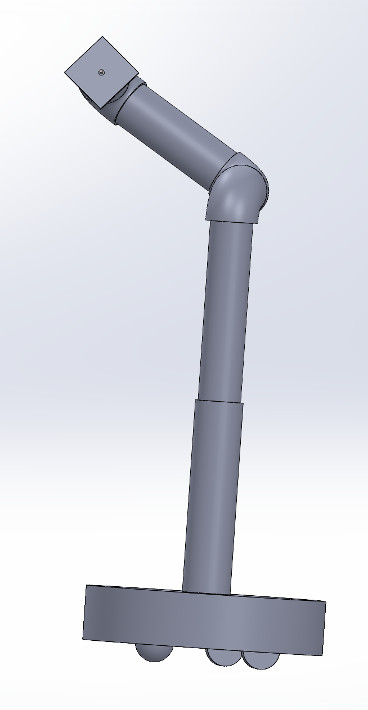

A robotic arm targeted at hobbyists to acheive repeatable programmable movements, such as panning, for camera shots. Done as a part of course work in a 4-person team in MIE243: Mechanical Design I.

**Highlights**
- **Acheived 6-axis Design:** Swivel base allows for rotation around z-axis whilst the base is moving.
- **Low Cost:** Constrained below $20,000, with robot arms for cinema typically being priced $100K-$500K.
- **Large Range of Motion:** Due to Roomba inspired base design, the arm is able to move virutally anywhere within the area assuming it is flat.

## 🔗 Project Resources

📄 [Check-In 1 Presentation](https://docs.google.com/presentation/d/1-3c3j0SQaKH2WOJd6BaiyDCT7N_2TE1bmaBynG-4J1E/edit?usp=sharing)

📄📽️ [Final Project Report](https://docs.google.com/document/d/16_lgdhgprQCKHzbRuZO_kxoZj7VZ-0ihIm0GkuNti2I/edit?usp=sharing)

🎥 [Check-In 2 CAD Model](MIE243CheckIn2ASSEMBLY.zip)  

🎥 📽️Final Deliverable CAD Model

** I designed the roomba base and camera mount. Credit to Lina Le for the arm and drawings.

## 👥 Working with Teammates
*My teamates for this project where Mae Perri (Team Lead), Lina Le (Note taker) and Maddie Lowes (Editor). I was the project manager. I tracked team tasks and dipslayed them on Gantt Charts using Miro. Here is some of the feedback I received:*

You have a lot of technical skills and explain the mechanisms in the course in a way that is very easy to understand. Your quality of drawings and 3d spatial skills are very admirable! Your sketches are very intuitive to understanding your designs. You make insightful points when giving feedback which allows me to improve my own ideas and designs!

Axel is a great teammate and project manager. He keeps the group on track and makes sure we are always prepared for deadlines. He also did an excellent job on research early on which helped us move the project along quickly. Axel communicates his ideas effectively and quickly both in our meetings and in our group chat online. The CAD model he prepared for our design was also very well made.

# Cinematography-Robot-Arm
---
## Results
**TBD**
- TBD

